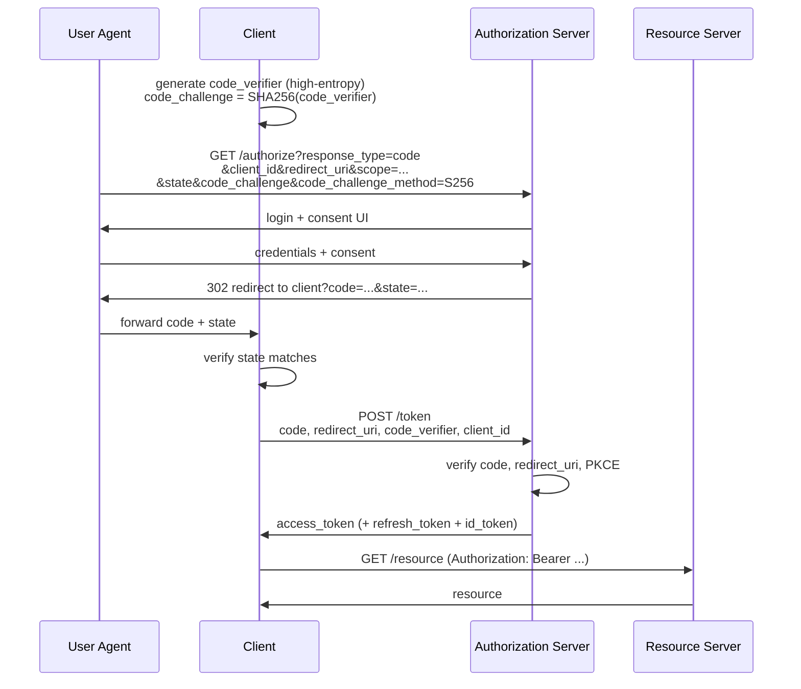
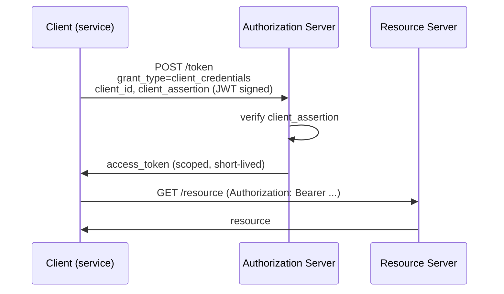
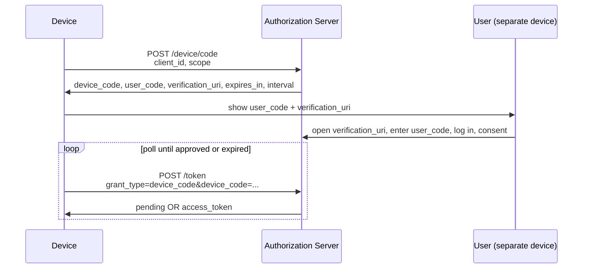

# OAuth 2.0 and OIDC Flows

OAuth 2.0 grants access to resources; OIDC extends OAuth with an
identity layer that returns an ID token. The flows below cover the
modern recommended grants. Implicit and Resource Owner Password
Credentials (ROPC) are listed only with their deprecation notices.

## Authorization Code with PKCE (the default)

Use for browser SPAs, mobile clients, server-side web apps, CLI tools
-- any client that can store a per-flow secret (the PKCE verifier) in
memory.



Requirements:

- `code_challenge_method=S256` (plain not allowed for confidential security).
- `state` parameter bound to the user's session for CSRF protection.
- Exact-match `redirect_uri` against pre-registered URIs at the auth
  server.
- For public clients (no client secret), PKCE is the only protection
  against authorization-code interception.

## Client Credentials (machine-to-machine)

Use for service-to-service calls within an organization, or partner
integrations with a registered client.



Requirements:

- Authenticate the client with `private_key_jwt` (signed JWT) or
  `tls_client_auth` (mTLS). Do not use client secrets for high-value
  services.
- Tokens carry only the scopes the calling service needs (least
  privilege).
- Per-client rate limits; per-scope rate limits where the surface is
  large.

## Device Code (input-constrained devices)

Use for smart TVs, CLI on a server with no browser, IoT devices.



Requirements:

- `user_code` displayed should be short (e.g., 8 characters) and
  selected from a confusable-free alphabet.
- Polling interval respected by the device; the auth server enforces
  exponential back-off.
- `device_code` and `user_code` are single-use, time-limited, and
  bound to the originating device's IP / fingerprint where possible.

## Refresh Tokens

A separate concern from any grant. With Authorization Code, refresh
tokens are issued at the `/token` exchange. With Client Credentials,
refresh is typically just re-requesting a new access token.

Rules:

- Rotate the refresh token on each use; revoke previous.
- Reuse detection: a refresh token re-used after rotation triggers
  revocation of the family and an alert.
- Cookie-based refresh in browsers: `HttpOnly; Secure; SameSite=Strict`
  on the cookie carrying the refresh token.
- Bind refresh tokens to the client identity (and to the device for
  high-assurance applications).

## OIDC additions

OIDC adds the `id_token`: a signed JWT that asserts who the user is.
It is consumed by the client, not sent to the resource server.

- Validate `iss`, `aud`, `exp`, `nonce` (matching the value sent in
  the authorize request).
- Use the `id_token` for sign-in only; never for API authorization.
  The `access_token` is for API calls.
- Honour `auth_time` and `acr` claims if the client needs to gate on
  fresh authentication or specific assurance level.

## Deprecated / warning-only flows

### Implicit grant

```text
GET /authorize?response_type=token&...
```

Returns the access token directly in the URL fragment. Deprecated in
the OAuth 2.0 Security Best Current Practice (RFC 9700) because the
token is exposed to browser history, referrer headers, and any code
running on the page. **Do not use for new development.**

### Resource Owner Password Credentials (ROPC)

```text
POST /token grant_type=password&username=...&password=...
```

The client collects the user's username and password and exchanges
them for a token. Forbidden in OIDC; discouraged in OAuth 2.0 BCP
(RFC 9700). **Do not use; defeats the entire delegation model and
prevents MFA.**

## Common attacks (and the defences above that block them)

| Attack | Defence |
| --- | --- |
| Authorization-code interception (mobile, public client) | PKCE |
| CSRF on the redirect URI | `state` parameter |
| Open redirect via `redirect_uri` | Exact-match registered URIs |
| Token theft via referrer or browser history | Authorization Code (no token in URL) |
| Mix-up attack (token intended for one client used at another) | `iss` claim in token response (RFC 9207); per-client redirect URIs |
| Refresh-token reuse | Rotation + reuse detection |
| ID-token replay (OIDC) | `nonce` verification |

## References

- RFC 6749 (OAuth 2.0): <https://datatracker.ietf.org/doc/html/rfc6749>
- RFC 6750 (Bearer Token Usage): <https://datatracker.ietf.org/doc/html/rfc6750>
- RFC 7636 (PKCE): <https://datatracker.ietf.org/doc/html/rfc7636>
- RFC 8628 (Device Code): <https://datatracker.ietf.org/doc/html/rfc8628>
- RFC 9207 (OAuth 2.0 Authorization Server Issuer Identification): <https://datatracker.ietf.org/doc/html/rfc9207>
- RFC 9700 (OAuth 2.0 Security Best Current Practice): <https://datatracker.ietf.org/doc/html/rfc9700>
- OpenID Connect Core: <https://openid.net/specs/openid-connect-core-1_0.html>
- OWASP OAuth2 Cheat Sheet: <https://cheatsheetseries.owasp.org/cheatsheets/OAuth2_Cheat_Sheet.html>
