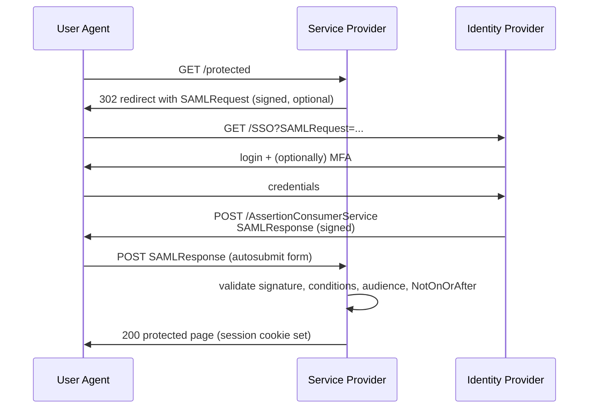

# SAML 2.0 Flows

SAML predates OIDC and is the dominant SSO protocol in enterprise
contexts. New systems should prefer OIDC ([oauth2-oidc-flows.md](oauth2-oidc-flows.md));
SAML remains common where the IdP and downstream services already
speak it.

## SP-initiated (the common case)



## IdP-initiated

The user starts at the IdP (e.g., from an IdP portal "tiles" page),
which posts an unsolicited assertion to the SP.

```mermaid
sequenceDiagram
    participant U as User Agent
    participant IdP as Identity Provider
    participant SP as Service Provider

    U->>IdP: navigate to portal, click "App X"
    IdP->>U: POST /AssertionConsumerService<br/>SAMLResponse (signed; RelayState optional)
    U->>SP: POST SAMLResponse
    SP->>SP: validate
    SP->>U: 200 home page
```

IdP-initiated is convenient but eliminates the SP's `SAMLRequest`,
which removes one CSRF-style protection. Combine with strict response
validation.

## Validation requirements at the SP

A correct SAML SP MUST:

1. Verify the signature on the Response and on every Assertion. The
   signing key must match an entry in the IdP metadata pinned for
   this SP.
2. Resolve the signed XML using a hardened parser (no DTD, no
   external entities -- see
   [../secure-coding/java/xxe-jaxb.md](../secure-coding/java/xxe-jaxb.md)).
3. Enforce signature wrapping defences: validate that the signed
   element is the same element you read claims from. Many libraries
   have had CVEs here; use a recent, audited library.
4. Validate `Conditions` (`NotBefore`, `NotOnOrAfter`).
5. Validate `AudienceRestriction` matches this SP's entity ID.
6. Validate `Destination` (or `Recipient` on the SubjectConfirmationData)
   matches the SP's ACS URL.
7. Enforce `InResponseTo` for SP-initiated flows; reject IdP-initiated
   responses on endpoints that should only accept SP-initiated.
8. Validate the assertion is single-use: track `ID` of recent
   assertions and reject replays within the validity window.

## Common attacks

### XML Signature Wrapping (XSW)

The attacker wraps a malicious assertion around a legitimate-looking
signed element so the signature still validates but the parser reads
different content. Defence: ensure the signature reference points to
the exact element from which the SP reads claims.

### XML External Entity (XXE)

A parser that resolves external entities can be used to read files
from the SP's filesystem. Defence: hardened XML parser per
[../secure-coding/java/xxe-jaxb.md](../secure-coding/java/xxe-jaxb.md).

### Replay

A captured assertion is replayed within its validity window. Defence:
single-use enforcement + short validity window.

### Audience confusion

An assertion intended for SP A is accepted by SP B. Defence:
`AudienceRestriction` validation per request.

### Open redirect via `RelayState`

`RelayState` is meant to carry the user's pre-login URL. If accepted
verbatim and used as a redirect target, it is an open redirect.
Defence: validate `RelayState` against an allow-list (e.g., paths
within the SP's own origin only).

## When SAML, when OIDC

| Driver | Pick |
| --- | --- |
| New corporate SSO project | OIDC |
| Existing IdP only speaks SAML | SAML for now; plan migration |
| Federation with a partner that requires SAML | SAML |
| Mobile / SPA client | OIDC + PKCE |
| Need fine-grained authorization tokens | OAuth 2.0 + OIDC |
| Legacy partner / vendor catalogue | SAML |

## References

- SAML 2.0 Core (OASIS): <https://docs.oasis-open.org/security/saml/v2.0/saml-core-2.0-os.pdf>
- SAML 2.0 Profiles: <https://docs.oasis-open.org/security/saml/v2.0/saml-profiles-2.0-os.pdf>
- SAML 2.0 Bindings: <https://docs.oasis-open.org/security/saml/v2.0/saml-bindings-2.0-os.pdf>
- OWASP SAML Security Cheat Sheet: <https://cheatsheetseries.owasp.org/cheatsheets/SAML_Security_Cheat_Sheet.html>
- Somorovsky et al. -- "On Breaking SAML: Be Whoever You Want to Be" (USENIX Security 2012): <https://www.usenix.org/conference/usenixsecurity12/technical-sessions/presentation/somorovsky>
